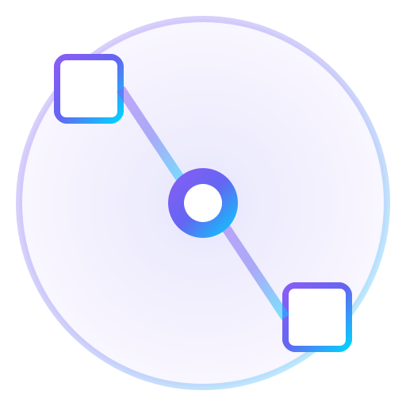

# LighthouseLayoutCoach



[Latest Release](https://github.com/Softlynn/LighthouseLayoutCoach/releases/latest)

Windows desktop app to help optimize **SteamVR Base Station 1.0** placement and reduce **Vive Tracker occlusion** for a hybrid setup (Quest Pro via Virtual Desktop → SteamVR, with OpenVR Space Calibrator alignment already done).

This app uses **SteamVR/OpenVR as the source of truth** (no Meta/Quest APIs).

## ✨ Features

- Live SteamVR device status (stations + trackers)
- Guided setup (pick 2 base stations + label 3 trackers by serial)
- Play-area layout view + heuristic coverage visualization
- VR Overlay Mode: stable SteamVR dashboard panel + optional VR Coach world overlay
- Optional historical-log-backed tracking heatmap (read-only prior session data)

## 📦 Download

- Latest release: https://github.com/Softlynn/LighthouseLayoutCoach/releases/latest

## 🛠️ Build / Dev (Windows)

1) Install Python 3.10+ (64-bit recommended)
2) Create and activate a venv:

```powershell
python -m venv .venv
.\.venv\Scripts\Activate.ps1
```

3) Install dependencies:

```powershell
pip install -r requirements.txt
```

4) Run:

```powershell
python -m lighthouse_layout_coach
```

Build EXE + optional installer:

```powershell
.\scripts\build_windows.ps1
```

Outputs:
- `dist\LighthouseLayoutCoach.exe`
- `dist\Installer\LighthouseLayoutCoach_Setup.exe` (if Inno Setup compiler `ISCC.exe` is installed)
- Release assets: `dist\release_assets\`

## 🧩 VR Overlay Notes

Commands:
- Desktop UI: `python -m lighthouse_layout_coach --desktop`
- VR overlay: `python -m lighthouse_layout_coach --vr` (alias: `--overlay`)
- Overlay smoke submit: `python -m lighthouse_layout_coach --overlay-test`

Modes:
- **Dashboard Panel**: SteamVR dashboard tab (controls + quick status)
- **VR Coach**: separate world overlay (playspace view with stations/trackers + optional layers)

Requirements:
- SteamVR running before starting VR Overlay Mode
- Allow localhost traffic if prompted (binds to `127.0.0.1` only)

Troubleshooting:
- If the overlay panel doesn’t appear in the SteamVR dashboard, restart SteamVR and try again.

## 📁 Logs (Historical Data)

Prior runs are stored in:
- `%APPDATA%\LighthouseLayoutCoach\sessions\*.json`

These files are treated as read-only data sources for the optional historical heatmap.

## 🧭 Playspace Resolution

Playspace bounds are resolved in SteamVR standing-universe coordinates using:
1) SteamVR Chaperone (`IVRChaperone.GetPlayAreaRect()` / collision bounds) when available
2) Default 2m×2m fallback when unavailable

Quest → SteamVR alignment (Virtual Desktop / Space Calibrator) is assumed to already be reflected in SteamVR’s standing origin; the app logs which playspace source was used.
